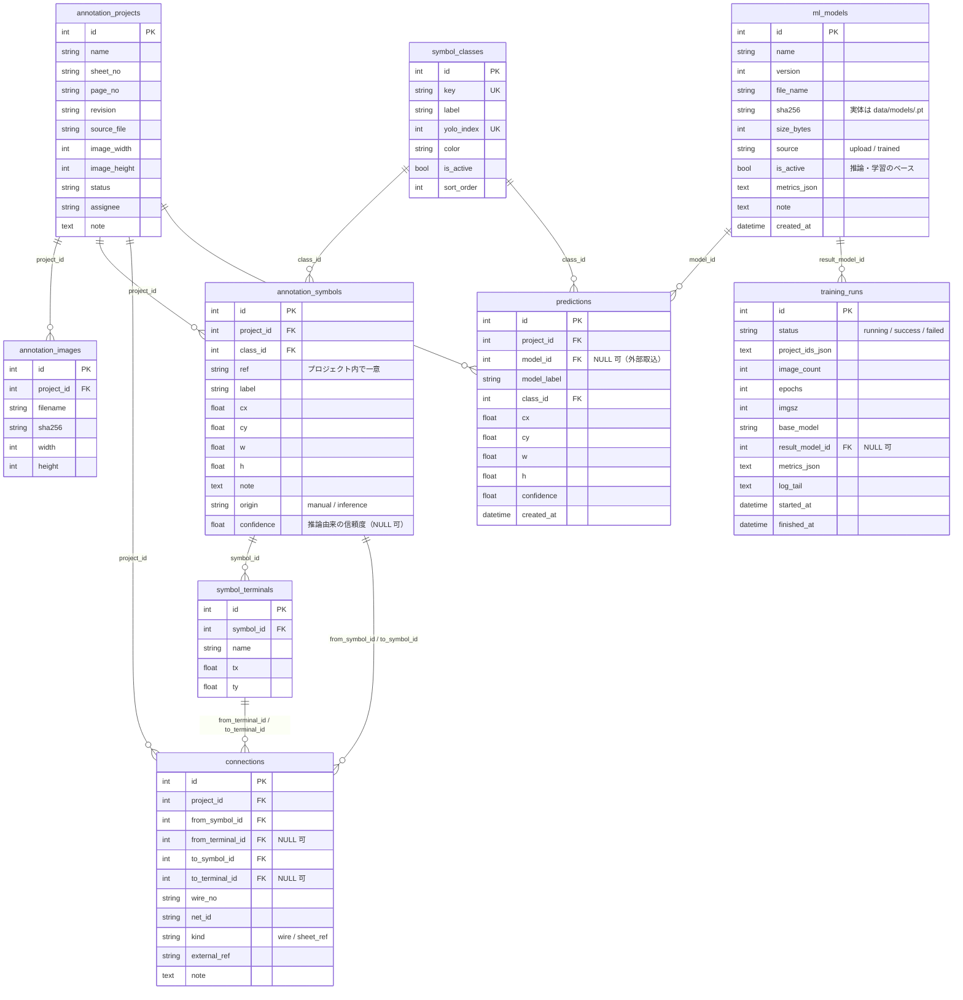

# ER 図

## 設計方針

### 座標

`annotation_symbols` の `cx, cy, w, h` と `symbol_terminals` の `tx, ty` は
すべて画像サイズで割った**正規化値（0.0〜1.0）**です。YOLO 形式と同じ表現のため、
エクスポート時に変換が不要になります。

ピクセル座標との相互変換は `services/geometry.py` の 1 ファイルに集約しています。
新しい変換処理を書く場合も必ずここを経由させてください。

### `ref` と主キーの使い分け

`annotation_symbols.ref`（`SYM-0001` 等）は**プロジェクト内で一意な参照名**で、
`(project_id, ref)` に UNIQUE 制約を持ちます。
エクスポート／インポートでは DB の主キーではなく `ref` で関係を表現するため、
別環境に取り込んでも配線の from-to が壊れません。

### データ設計で意識した既知リスクへの対応

| 一般的なアノテーション DB で起きがちなリスク | 本ツールでの対応 |
|---|---|
| `class_id は Python 配列の添字で、DB 上の参照先がない` | `symbol_classes` マスタを用意し、`yolo_index` を UNIQUE として明示採番。`annotation_symbols.class_id` は FK |
| `画像を base64 テキストで保存しているため、検索・バックアップ・移行の負荷が高い` | 画像実体は `data/images/<sha256>.png` に保存し、DB にはメタデータ（filename / sha256 / width / height）のみ |
| `親子関係が FK で追跡できない` | 配線は `from_symbol_id` / `to_symbol_id` / `from_terminal_id` / `to_terminal_id` の FK で保持 |

### 削除の伝播

`annotation_projects` を削除すると、`images` / `symbols` / `connections` /
`predictions` が `cascade="all, delete-orphan"` で連鎖削除されます。
シンボルを削除すると、その端子と、そのシンボルを含む配線も削除されます。
`ml_models` を削除しても `predictions` / `training_runs` は残り（`model_id` /
`result_model_id` は NULL に）、実体ファイルは他モデルと sha256 を共有しない
場合のみ削除されます。

### AI 改善サイクルのデータ

- `predictions` は図面ごとに**最新の推論だけ**を保持する作業領域で、
  人が確認・修正して `annotation_symbols`（`origin=inference`）へ昇格させたものが
  学習データとして蓄積される、という分担です。
- `training_runs` は学習ジョブの実行履歴。成功時は結果の `best.pt` が
  `ml_models` に `source=trained` かつ `is_active` で登録されます。

### DB 変更時の運用ルール

新機能やカラム追加が必要な場合は、コードを書く前に **DB 構造変更案を提示し、承認後に実装**します。
既存テーブルへ安易にカラムを足すのではなく、正規化・既存データ移行・DDL・ロールバック・
インデックス・関連ドキュメントの更新範囲を先に検討してください。
